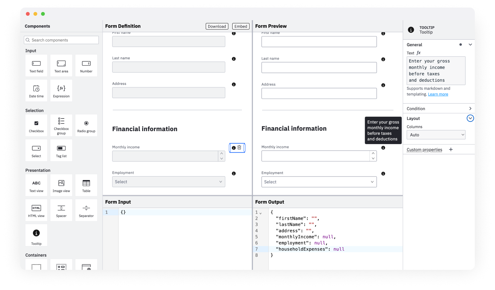

# form-js Tooltip Component

A custom tooltip form component built using [form-js](https://github.com/bpmn-io/form-js).



## About

We extend form-js with a custom component that shows the info icon with a tooltip when hovering over it. The tooltip text is configured from the component's properties panel.
To achieve that we will walk through the following steps:

* Add a custom form component renderer
* Add custom styles for the tooltip component
* Add custom properties panel entries

A step-by-step guide can be found here:
[Form-js Custom Components Example](https://github.com/bpmn-io/form-js-examples/tree/master/custom-components)

### Add a custom form component renderer

The first step is to add a custom form component renderer. 

The renderer is responsible for rendering the component in the form editor and the form preview. It also handles the interaction with the component.

We create the [`TooltipRenderer`](./app/extension/render/Tooltip.js) which defines a couple of things

* a [preact](https://preactjs.com/) component that renders the component in the form editor and preview by re-using an existing component `Text`.

```js
import {
  FormContext,
  Text,
  useTemplateEvaluation,
  MarkdownRenderer,
  sanitizeHTML,
} from '@bpmn-io/form-js';

import {
  html,
  useContext
} from 'diagram-js/lib/ui';

import './styles.css';

const getInfoIconSVG = () => html`
  <svg width="20" height="20" viewBox="0 0 20 20" fill="none" xmlns="http://www.w3.org/2000/svg">
    <rect width="20" height="20" fill="white" fill-opacity="0.01" style="mix-blend-mode:multiply"/>
    <path d="M10 3.75C8.76387 3.75 7.5555 4.11656 6.52769 4.80331C5.49988 5.49007 4.6988 6.46619 4.22576 7.60823C3.75271 8.75027 3.62894 10.0069 3.87009 11.2193C4.11125 12.4317 4.70651 13.5453 5.58058 14.4194C6.45466 15.2935 7.56831 15.8887 8.78069 16.1299C9.99307 16.3711 11.2497 16.2473 12.3918 15.7742C13.5338 15.3012 14.5099 14.5001 15.1967 13.4723C15.8834 12.4445 16.25 11.2361 16.25 10C16.25 8.3424 15.5915 6.75268 14.4194 5.58058C13.2473 4.40848 11.6576 3.75 10 3.75ZM10 6.42857C10.1324 6.42857 10.2619 6.46784 10.372 6.54143C10.4822 6.61501 10.568 6.71959 10.6187 6.84195C10.6694 6.96431 10.6826 7.09896 10.6568 7.22885C10.6309 7.35875 10.5672 7.47807 10.4735 7.57172C10.3799 7.66537 10.2605 7.72915 10.1306 7.75499C10.0007 7.78083 9.8661 7.76757 9.74374 7.71688C9.62138 7.6662 9.5168 7.58037 9.44321 7.47025C9.36963 7.36012 9.33036 7.23066 9.33036 7.09821C9.33036 6.92061 9.40091 6.75029 9.52649 6.6247C9.65207 6.49912 9.8224 6.42857 10 6.42857ZM11.7857 13.6272H8.21429V12.6228H9.49777V10.0558H8.66072V9.05134H10.5022V12.6228H11.7857V13.6272Z" fill="#161616"/>
  </svg>
`;

export function TooltipRenderer(props) {
  const {
    field
  } = props;

  const {
    text,
    strict = false,
    id
  } = field;

  const { formId } = useContext(FormContext);

  const markdownRenderer = new MarkdownRenderer();

  // feelers => pure markdown
  const markdown = useTemplateEvaluation(text, { debug: true, strict });

  // markdown => html
  const htmlText = useMemo(() => markdownRenderer.render(markdown), [markdownRenderer, markdown]);

  const getSanitizedHtml = () => ({
    __html: sanitizeHTML(htmlText)
  })

  return html`
    <div class="fjs-tooltip-container">
      <div class="fjs-tooltip-icon info-icon" data-tooltip-id=${prefixId(id, formId)}>
        ${getInfoIconSVG()}
      </div>
      <div class="fjs-tooltip-text" id=${prefixId(id, formId)} dangerouslySetInnerHTML=${getSanitizedHtml()}/>
    </div>
  `;
}
```

* a component `config` that extends the base `Text` configuration and adds customizations as the icon, a custom label and the default properties panel entries to show

```js
import { Text } from '@bpmn-io/form-js';
import InfoIcon from './info-icon.svg';

TooltipRenderer.config = {
    /* Extend the default configuration of existing fields */
  ...Text.config,
  type: tooltipType,
  label: 'Tooltip',
  iconUrl: `data:image/svg+xml,${encodeURIComponent(InfoIcon)}`,
  group: 'presentation',
  propertiesPanelEntries: [
    'text'
  ],
  create: (options = {}) => ({
    text: 'Tooltip', // Set the default text.
    ...options,
  }),
};
```

### Register the custom renderer

We use the `formFields` service to register our custom renderer for the `tooltip` type.

```js
class CustomFormFields {
  constructor(formFields) {
    formFields.register(tooltipType, TooltipRenderer);
  }
}

export default {
  __init__: ['tooltipField'],
  tooltipField: ['type', CustomFormFields]
};
```

### Add custom styles

We define custom styles for the Tooltip component by adding a simple CSS file [`styles.css`](./app/extension/render/styles.css). For the example we import the styles directly to the component as we have a bundler ([webpack](https://webpack.js.org/)) in place that adds the styles to the application.

```css
.fjs-tooltip-container {
  position: relative;
  display: inline-block;
}

.info-icon {
  display: flex;
  justify-content: center;
  align-items: center;
  width: 24px;
  height: 24px;
  cursor: pointer;
}

.info-icon:hover + .fjs-tooltip-text {
  visibility: visible;
  opacity: 1;
}

.fjs-tooltip-text {
  visibility: hidden;
  position: absolute;
  z-index: 1;
  bottom: 100%; /* Position above the icon */
  left: 12px;
  transform: translateX(-50%);
  padding: 8px;
  background-color: var(--color-grey-225-10-15);
  color: var(--color-white);
  border-radius: 4px;
  white-space: nowrap;
  opacity: 0;
  transition: opacity 0.2s;
  z-index: 10;
}

.fjs-tooltip-text > * {
  margin: 0;
  line-height: normal;
}
```

### Add custom properties panel entries

With `config.propertiesPanelEntries` we define the default properties panel entries to show for the component. We can also add custom entries to the properties panel.

We add a [`CustomPropertiesProvider`](./app/extension/propertiesPanel/CustomPropertiesProvider.js) to be able to specify additional properties. For this component, there are no additional properties defined.

```js
export class CustomPropertiesProvider {
  constructor(propertiesPanel) {
    propertiesPanel.registerProvider(this, 500);
  }

  getGroups() {
    return (groups) => {
      return groups;
    };
  }
}

CustomPropertiesProvider.$inject = [ 'propertiesPanel' ];
```

### Plugging Everything together

To embed the customizations into the form-js we need to plug everything together. We do that by including the custom renderer into both editor and preview via `additionalModules` and registering the custom properties provider to the editor via `editorAdditionalModules`.

```js
import { FormPlayground } from '@bpmn-io/form-js';

import TooltipExtension from './extension/render';
import TooltipPropertiesExtension from './extension/propertiesPanel';

import '@bpmn-io/form-js/dist/assets/form-js.css';
import '@bpmn-io/form-js/dist/assets/form-js-editor.css';
import '@bpmn-io/form-js/dist/assets/form-js-playground.css';

import './style.css';

import schema from './empty.json';

new FormPlayground({
  container: document.querySelector('#form'),
  schema: schema,
  data: {},
  additionalModules: [TooltipExtension],
  editorAdditionalModules: [TooltipPropertiesExtension]
});
```

## Building

You need a [NodeJS](http://nodejs.org) development stack with [npm](https://npmjs.org) installed to build the project.

To install all project dependencies execute

```
npm install
```

Spin up a development setup by executing

```
npm run dev
```